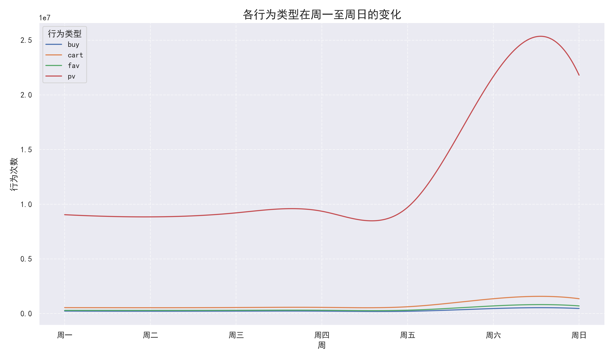
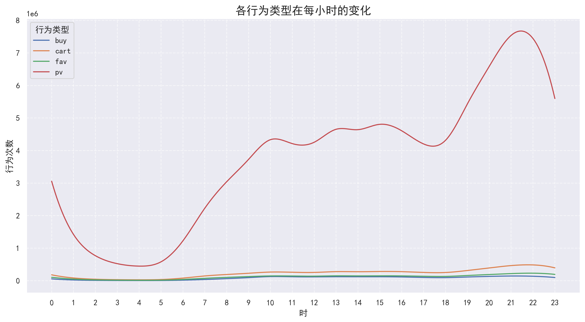
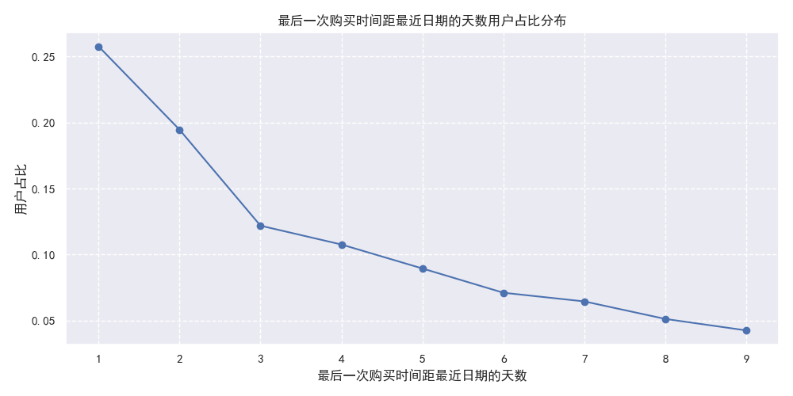

# 淘宝用户行为分析项目
数据来源：[https://tianchi.aliyun.com/dataset/649](https://tianchi.aliyun.com/dataset/649)
## 项目概述

本项目旨在分析电子商务平台用户的行为数据，通过对用户行为的时间模式、用户价值（RFM模型）以及用户转化路径（漏斗模型）进行深入分析，挖掘用户行为规律，为平台的精细化运营、用户管理和营销策略提供数据支持。

## 数据来源与描述

* **数据来源**: `UserBehavior.csv` 文件。
* **数据量**: 原始数据包含约 1 亿条用户行为记录。
* **时间范围**: 清洗和筛选后的数据涵盖时间段为 2017年11月25日至2017年12月3日。
* **字段说明**:
    * `user id`: 用户ID。
    * `item id`: 商品ID。
    * `item category id`: 商品类别ID。
    * `behavior type`: 用户行为类型 (pv: 浏览, cart: 加入购物车, fav: 收藏, buy: 购买)。
    * `time`: 行为发生的时间戳。

## 数据清洗与准备

1.  **加载数据**: 使用 pandas 加载 `UserBehavior.csv` 文件。
2.  **处理缺失值**: 检查并确认数据无缺失值。
3.  **处理重复值**: 删除重复的用户行为记录。
4.  **时间格式转换**: 将时间戳转换为北京时间 (UTC+8)，格式为 `datetime`。
5.  **异常日期过滤**: 筛选出指定时间范围内 (2017-11-25 00:00:00 至 2017-12-03 23:59:59) 的数据。
6.  **特征提取**: 从时间数据中提取星期 (`weekday`) 和小时 (`hour`) 作为新的特征。

## 探索性数据分析 (EDA) - 时间维度分析

### 每周用户行为分析

* **分析**: 通过按星期 (`weekday`) 和行为类型 (`behavior type`) 分组，统计了不同行为在一周内的发生次数。
* **可视化**: 使用 `seaborn` 生成了折线图，展示了四种行为 (pv, cart, fav, buy) 从周一到周日的变化趋势。

* **发现**:
    * 所有用户行为在**周末（周六、周日）显著增加**，达到峰值。浏览量 (pv) 在周末激增最为明显。
    * 工作日（周一至周五）的行为次数相对平稳，略有波动。
* **建议**:
    * **营销活动侧重周末**: 周末是用户活跃度最高的时段，应将主要的促销活动、新品发布等安排在周末，以获得更高的曝光和转化。
    * **工作日维系**: 工作日可以通过推送个性化信息、小额优惠等方式维持用户粘性。

### 每小时用户行为分析

* **分析**: 通过按小时 (`hour`) 和行为类型 (`behavior type`) 分组，统计了不同行为在一天24小时内的发生次数。
* **可视化**: 使用 `seaborn` 生成了折线图，展示了四种行为在一天内各小时的变化趋势。

* **发现**:
    * 用户活跃度在**凌晨时段（1点至6点）最低**。
    * 从早上 7 点开始，用户活跃度逐渐上升。
    * **晚上 19 点至 22 点是用户最活跃的时段**，各类行为次数达到顶峰。
    * 购买行为 (buy) 的高峰期相对集中在中午 (10-15点) 和晚上 (19-22点)。
* **建议**:
    * **精准推送**: 在用户活跃高峰期（尤其是晚上 19-22 点）进行营销信息推送、直播活动等，可以提高触达率和参与度。
    * **优化服务器**: 在高峰时段确保服务器稳定性和响应速度，提升用户体验。
    * **避开低谷**: 避免在凌晨低活跃时段进行大规模推广活动。

## 用户价值 RFM 分析

RFM 模型通过三个维度评估用户价值：

* **Recency (R)**: 用户最近一次消费时间距今的天数。
* **Frequency (F)**: 用户在统计周期内的消费次数。
* **Monetary (M)**: 用户在统计周期内的消费总金额 (注：本数据集中无金额信息，因此只进行 RF 分析)。

### R (最近一次购买时间) 分析

* **计算**: 计算每位购买用户最后一次购买时间距离参考点 "2017-12-04" 的天数（+1 处理）。
* **分布**:
    * 超过 35% 的用户在分析结束前的最后一天 (Recency=1) 有购买行为。
    * 约 20% 的用户在倒数第二天 (Recency=2) 有购买行为。
    * 最近 3 天内有购买行为的用户占比超过 65%。
    * 随着 R 值的增大（即距离最后购买日期越远），用户占比迅速下降。
* **可视化**: Matplotlib 折线图展示了用户最后一次购买时间距参考点的天数分布。

* **R 分数设定**:
    * R=1天 -> R分数=4
    * R=2-3天 -> R分数=3
    * R=4-6天 -> R分数=2
    * R>=7天 -> R分数=1

### F (购买频率) 分析

* **计算**: 统计每位用户在分析周期内的购买次数。
* **分布**:
    * 超过 70% 的用户在分析周期内只购买了 1 次。
    * 购买 2 次的用户占比约 15%。
    * 购买 3 次的用户占比约 5%。
    * 购买次数越多的用户，占比越低，呈现典型的长尾分布。
* **可视化**: Matplotlib 折线图展示了购买频次的用户占比分布 (1-30次)。

* **F 分数设定**:
    * F=1次 -> F分数=1
    * F=2-3次 -> F分数=2
    * F=4-7次 -> F分数=3
    * F>=8次 -> F分数=4

### 用户分层结果与分析

根据 R 分数和 F 分数，将用户分为四类：

| 用户类别     | R 分数 | F 分数 | 用户数   | 占比 (%) | 特征描述                                 |
| :----------- | :----- | :----- | :------- | :------- | :--------------------------------------- |
| **重要价值客户** | >= 3   | >= 3   | 142,836  | 21.24%   | 最近购买过，且购买频率高，是核心价值用户。 |
| **潜力客户** | >= 3   | < 3    | 243,089  | 36.15%   | 最近购买过，但购买频率低，有提升空间。     |
| **即将流失客户** | < 3    | >= 3   | 42,849   | 6.37%    | 曾经购买频率高，但最近没有购买，有流失风险。 |
| **流失客户** | < 3    | < 3    | 243,630  | 36.23%   | 最近未购买，购买频率也低，价值较低或已流失。 |

**分析**:

* **潜力客户和流失客户占比最高**: 两者合计超过 72%。这表明平台有大量近期有过购买但频次不高的用户，以及大量低频且近期未购买的用户。
* **重要价值客户是核心**: 虽然占比只有 21.24%，但这部分用户贡献了较高的购买频率，是平台的忠实用户和主要收入来源。
* **即将流失客户需重点关注**: 占比虽小 (6.37%)，但这部分用户曾经是高频购买者，近期活跃度下降，挽回价值较高。

### RFM 分析操作建议

* **重要价值客户 (R高, F高)**:
    * **策略**: 重点维护，提升忠诚度和客单价。
    * **操作**: 提供 VIP 服务、新品优先体验、专属优惠、积分奖励、生日关怀等，鼓励他们持续购买和分享。
* **潜力客户 (R高, F低)**:
    * **策略**: 提高购买频率，转化为价值客户。
    * **操作**: 基于其最近购买记录进行相关推荐、发放品类优惠券、推送促销信息、引导参与会员计划、鼓励凑单满减等。
* **即将流失客户 (R低, F高)**:
    * **策略**: 主动召回，防止流失。
    * **操作**: 分析其流失原因（是否竞品活动、产品问题等），通过短信/App 推送进行个性化召回（如“好久不见”专属优惠）、强调会员权益、推送其历史偏好商品或品类的降价/活动信息。
* **流失客户 (R低, F低)**:
    * **策略**: 低成本触达，尝试激活或判断是否彻底流失。
    * **操作**: 批量发送普适性优惠信息（如大额满减券），分析是否有少量用户被激活。若成本允许，可尝试小范围召回；若成本较高，可暂时搁置或降低触达频率。

## 漏斗分析

漏斗分析用于追踪用户从浏览到最终购买的转化路径和流失情况。本分析构建了两个主要漏斗：`pv → cart → buy` 和 `pv → fav → buy`。

### 漏斗计算逻辑

1.  **排序**: 按时间对用户行为日志排序。
2.  **首次行为时间**: 对每个用户、每个商品，获取其首次发生 pv, cart, fav, buy 的时间。
3.  **时间顺序约束**: 在计算漏斗时，确保行为发生的时间顺序符合漏斗路径（例如，`cart` 时间 >= `pv` 时间，`buy` 时间 >= `cart` 时间）。
4.  **指标计算**:
    * 统计每个环节（pv, cart/fav, buy）的**唯一用户商品对**数量（即有多少 "人次" 完成了该环节）。
    * 计算相邻环节的转化率和从起点到终点的总转化率。

### 漏斗分析结果

**漏斗：pv → cart → buy**

* 浏览人数 (pv) : 71,015,192
* 加购人数 (cart) : 760,253 **(转化率: 1.07%)**
* 购买人数 (buy) : 69,666 **(总转化率: 0.10%, 从 cart 到 buy 转化率: 9.16%)**

**漏斗：pv → fav → buy**

* 浏览人数 (pv) : 71,015,192
* 收藏人数 (fav) : 336,359 **(转化率: 0.47%)**
* 购买人数 (buy) : 26,846 **(总转化率: 0.04%, 从 fav 到 buy 转化率: 7.98%)**

**分析**:

* **浏览到加购/收藏的转化率低**: 从浏览到加购的转化率仅为 1.07%，到收藏的转化率更低，仅为 0.47%。这是用户流失最严重的环节。
* **加购/收藏到购买的转化率尚可**: 从加购到购买的转化率为 9.16%，从收藏到购买的转化率为 7.98%。这表明一旦用户将商品加入购物车或收藏夹，其购买意愿相对较高。
* **加购路径转化更高**: 对比两个漏斗，通过加购路径最终实现购买的总转化率 (0.10%) 高于收藏路径 (0.04%)。加购行为比收藏行为更能预测最终的购买。
* **整体转化率低**: 从浏览到最终购买的总转化率非常低 (0.10% 和 0.04%)，说明用户购买决策链路长，流失严重。

### 漏斗分析操作建议

* **优化浏览到加购/收藏环节**:
    * **提升商品吸引力**: 优化商品主图、标题、详情页描述，突出卖点，提高用户兴趣。
    * **价格竞争力**: 确保价格具有优势，或提供明确的优惠信息（如限时折扣、优惠券）。
    * **简化操作**: 优化 "加入购物车" 和 "收藏" 按钮的位置和显眼度，减少用户操作成本。
    * **推荐精准度**: 提高商品推荐算法的精准度，让用户更容易发现感兴趣的商品。
    * **用户评论与评分**: 鼓励用户评价，展示高质量评论，增强其他用户的信任感。
* **提高加购/收藏到购买的转化率**:
    * **购物车营销**:
        * 对购物车中的商品进行降价提醒、库存紧张提醒。
        * 提供购物车凑单优惠、满减活动。
        * 针对长时间未结算的购物车进行召回提醒（邮件/App Push）。
    * **收藏夹营销**:
        * 对收藏夹中的商品进行降价/促销活动通知。
        * 推荐收藏商品的相似或搭配商品。
    * **简化结算流程**: 优化支付流程，减少步骤，提供多种支付方式，确保支付顺畅。
    * **消除顾虑**: 提供清晰的物流信息、退换货政策、客服支持，打消用户购买顾虑。
* **区分对待加购与收藏用户**:
    * 对加购用户的营销触达可以更直接、更侧重于临门一脚的转化（如限时优惠券）。
    * 对收藏用户的营销可以更侧重于长期的兴趣维系和时机触发（如降价提醒）。
